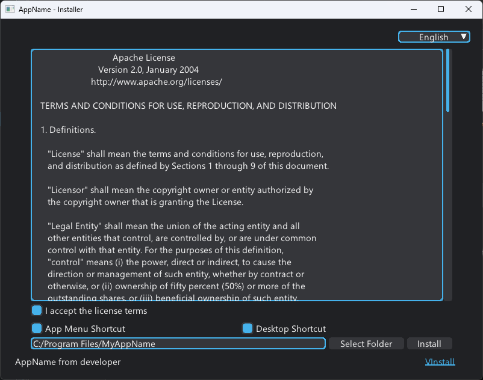
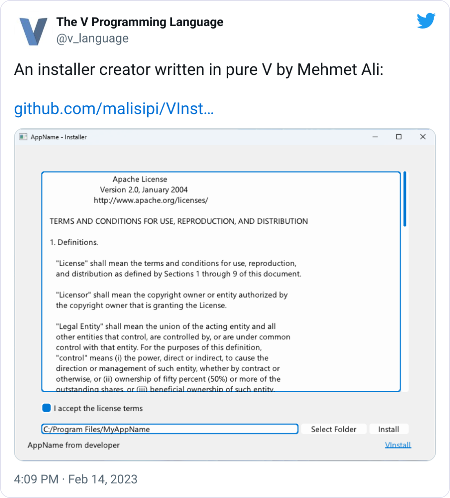

# VInstall *- A Cross-Platform Installer Creator*



## How to Use?

* Get V compiler from [vlang.io](https://vlang.io/)
* Install MUI library `v install malisipi.mui`
* Instal (the) VInstall library `v install malisipi.VInstall`
* And create some installers

Basic Installer:

```v
import malisipi.vinstall

vinstall.run(
    app_developer: "developer",
    app_name: "AppName",
    install_path:"C:/Program Files/MyAppName",
    license_txt: $embed_file('license.txt'),
    app_zip: $embed_file('app.zip'),
    executable_path: "app.exe"
)!
```

## Properties

* Integrate with V applications
* Support Windows 7 & above
* Single executable for distirbuting
* Shortcut Support
* Uninstall Capabilities
* Dark Mode Support
* Multilingual Support (English / Turkish / Russian / German / French / Spanish)

> Some translations was done with Translate. This translations can be missing as grammar and spelling. Let me know if a translation is wrong.

TODO:

* Linux/MacOS support
* Portable install support
* Support downloading install file
* Creation of registry (for Windows) and .INI entries
* Support for passworded and encrypted installs

## Thirdparty

* [MUI](https://github.com/malisipi/mui) (UI-Library) - Licensed with Apache 2.0

## Thanks to V-language for Mention

[](https://twitter.com/v_language/status/1625482422174228486)

## License

* This library licensed with Apache License 2.0.
