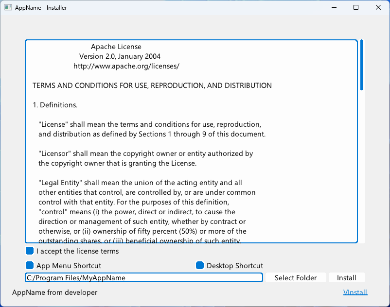

# VInstall *- A Cross-Platform Installer Creator*



## How to Use?

```v
import malisipi.vinstall

vinstall.run(
    app_developer: "developer",
    app_name: "AppName",
    install_path:"C:/Program Files/MyAppName",
    license_txt: $embed_file('license.txt'),
    app_zip: $embed_file('app.zip')
)!
```

## Properties

* Integrate with V applications
* Support Windows 7 & above
* Single executable for distirbuting

TODO:

* Linux/MacOS support
* Uninstall Capabilities
* Creation of registry (for Windows) and .INI entries
* Support for passworded and encrypted installs
* Shortcuts
* Multilingual Support
    * Turkish
    * French
    * Spanish
    * Russian
    * German
    * and other languages...

## Thirdparty

* [MUI](https://github.com/malisipi/mui) (UI-Library) - Licensed with Apache 2.0

## License

* This library licensed with Apache License 2.0.